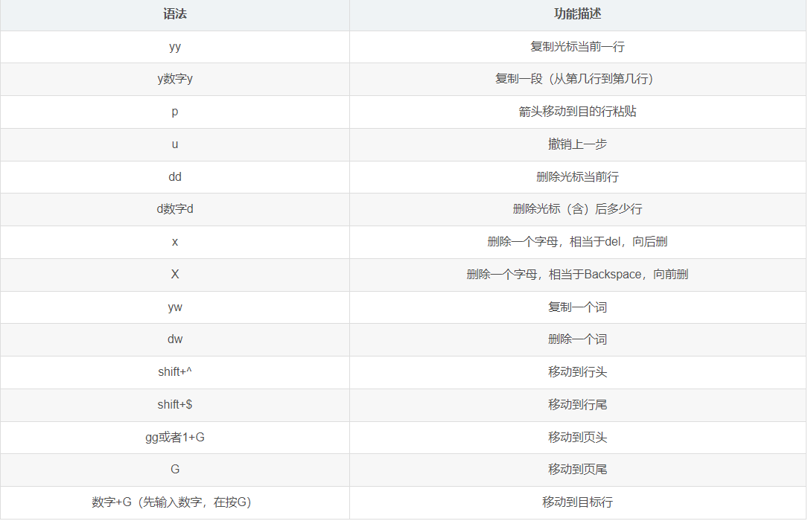
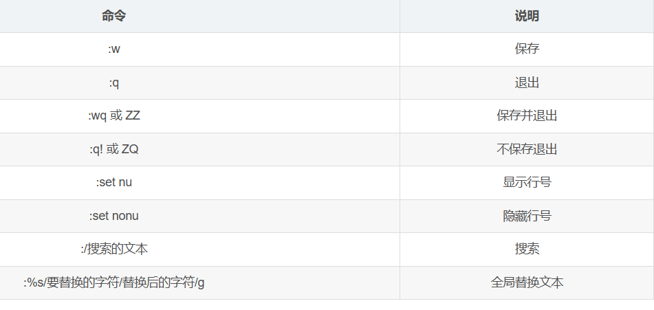
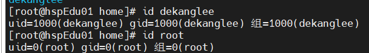

### 1.linux学习1

#### 1.1具体的目录结构

/bin(/usr/bin，/usr/local/bin)，这里bin的binary的缩写，这个目录下面存放着各种可执行文件，就是常用的命令。
/sbin，(/usr/sbin，/usr/local/sbin)，这里的s代表super user的意思，这里存放的是系统管理员管理系统用到的命令。
/home 目录是存放用户目录的主目录，里面的每一个文件夹都是一个用户。
/root 目录的系统管理员的主目录
/lib 目录存放系统运行需要的动态链接库，相当于windows里的dll文件。
/lost+found 目录存放系统非法关机时的文件。
/etc 目录存放应用的配置文件，比如安装mysql数据库，这个应用的配置文件均存放于该目录下，如果要修改某个应用的配置，也应该到该目录下找到相应应用的配置文件。
/usr 用户安装的应用程序均默认放置于该目录下。
/boot 目录存放linux启动的相关文件，如果该文件夹被破坏会导致系统不能启动。
/proc 目录是系统虚拟出来的目录，它是系统内存的映射，可以访问该目录获取系统信息，但该目录不能修改，否则会导致系统崩溃。
/srv service的缩写，该目录存放一些服务启动后需要提取的数据。
/sys 该目录安装了linux2.6内核中新出现的文件系统sysfs
/tmp 目录存放一些临时文件
/dev 类似于windows的设备管理器，把所有的硬件通过文件的形式管理。
/media media的意思就是介质，这个目录主要是用于识别如，U盘、光驱等等。识别后，Linux会把识别的设备挂载到该目录。
/mnt 系统提供该目录是为了让用户临时挂载其他文件系统，可以将外部存储挂载到/mnt目录上。
/opt 目录存放给系统安装程序时使用的软件包。
/usr/local 目录是用户安装后该软件安装的目标目录，一般是通过编译源码的形式安装。
/var 目录存放着不断扩充的文件，习惯将经常被修改的目录存放在该目录下，典型的是系统的日志文件。
/selinux [security-enhanced-linux]SElinux是一种安全子系统，它能控制程序只能访问特定程序，有三种工作模式，可以自行设置。

#### 1.2 vim的常用命令

vim是常用的文件编辑工具，主要有一般模式，命令模式，插入模式。下面是一般模式的常用命令快捷键。

在一般模式下，输入i，I等字母就回进入，插入模式可以手动插入所需要编辑的内容。这也是常用的模式，在该模式下通过Esc键可以返回一般模式。在一般模式下通过输入:或者/可以进入命令模式。下面是常用的命令。

查找命令/文本查找到后继续输入n会跳转到下一个。vim的键盘图如下所示。
![3(picture/vim键盘.png)

#### 1.3 linux关机重启指令

`shutdown -h now` 其中`-h`代表halt，这条命令会让系统立刻关机，与`halt`命令相同。`shutdown -h 1`代表1分钟后系统会关机，并且会通知其他用户。`shutdown -r now`为立刻重启系统，与`reboot`命令相同。在系统重启或者关机前应该运行`sync`命令，该命令会把内存的数据写到磁盘里。这些命令需要在root权限下运行。

#### 1.4 用户登录与注销

1.一般来说，为保证系统安全尽量不使用root用户登录，使用普通账号登录。登录后通过`su-user`来切换到root用户。
2.切换到root用户使用logout命令退回到之前的普通用户。这里需要注意的是从权限高的用户切换至权限低的用户是不需要输入用户密码的，反之不然。
3.这里需要注意`su - root` 与 `su root`的区别，前者会完全切换到root用户，包括环境变量等。而后者仅仅是使当前用户获得root的权限，并且退出使用`exit`而不是`logout`。

#### 1.5 用户管理

1.用户添加:`useradd username`该命令需要root权限，并且用户创建之后会在`/home/username`目录下存放着该用户的所有文件。
2.可以使用`useradd -d /test username` 指定用户目录。添加用户后可以在root权限下设置用户的登录密码`passwd username`，如果不加`username`会默认更改当前用户密码。
3.用户删除，`userdel username` 这个命令可以删除用户，但是用户的文件目录仍然存在。如果想要将用户删除的同时将其对应的目录也删掉可使用`userdel -r username`。
4.可以使用`id username`显示用户信息，如下图所示。

在当前用户shell中使用`whoami`可以查看当前用户信息。

#### 1.6 用户组
+
用户组类似于角色的概念，系统可以对具有共性/权限的用户进行统一管理。添加用户时会默认生成一个与用户id相同的group里面就是这个用户。
1.新建用户时可以使用`useradd -g groupname uesrname` 来将新用户添加到`groupname`组中。
2.对于已经建立过的用户可以使用`usermod -g groupname username`，将`username` 添加到`groupname`中。
3.与用户和用户组相关的文件目录是`/etc/passwd`是用户的配置文件，其每一行代表一个用户信息，共有7段每一段使用:分割，分别代表，用户名:口令:用户识别号:组标识号:注释性描述:主目录:登录shell，记录用户的信息。`/etc/shadow`口令的配置文件，`/etc/group`用户组的配置文件。

#### 1.7 指定运行级别

运行级别存在7个等级，分别是:
0:关机
1:单用户，常用来找回丢失密码
2:多用户状态，没有网络服务
3:多用户状态，有网络服务
4:系统未使用保留给用户
5:图形界面
6:重启系统
一般来说，以上常用的运行级别是3和5，以上运行级别均可以通过`init __`命令来指定。如在图形界面终端运行`init 3`则系统会退出图形界面，进入终端界面。使用命令`systemctl get-default`获得当前系统的运行状态。这里必须注意的是，系统的运行级别和使用什么方式登录终端无关（比如使用ssh），指的仅仅是系统本身正在运行的状态。

#### 1.8 找回root密码

本质上可以通过进入单用户模式进入系统，通过命令重写root密码。
1、重启系统在启动界面按e键，可进入编辑内核。
2、在指定行添加`inti=/bin/sh`并按下`Ctrl + x`即可重启系统进入单用户模式。
3、在命令行输入`mount -o remount,rw /`按回车键，此时可对内核进行读写操作。
4、输入`passwd root`，给root重设密码。
5、运行`touch /.autorelabel`新建`.autorelabel`文件。
6、运行`exec /sbin/inti`重启系统，设置即可生效。
这里注意`.autorelabel`文件是必须的，创建该文件可以让`SELinux`策略放行，使更改生效。`SELinux`是系统的安全增强策略，内有维护系统安全的规则。

#### 1.9 文件目录类

文件目录可分为绝对路径与相对路径，比如当前在`/hmoe`目录下，使用`cd /home/uesr/file`这种方式访问的是绝对路径，绝对路径是从根目录开始定位的，而使用`cd user/file`会直接访问该文件，这种方式是相对路径。
1.`pwd`命令显示当前目录的绝对路径。
2.`cd [参数]`参数为绝对路径或者相对路径。有两个特殊用法:`cd ~`会进入当前用户的`home`目录，`cd ..`会退回上一级目录。
3.`mkdir dirname`在当前的目录下创建新目录，该命令不可以创建多级目录。可以通过增加参数`mkdir -p /dirname0/dirname1`创建多级目录，需要注意这里`/dirname0/dirname1`应为目标路径的绝对路径，否则会从根目录开始建立。
4.`rmdir dirname`命令可以用来删除空目录，如果目录不为空则无法删除。可以通过`rm -rf dirname`来强制删除非空目录。
5.`touch file`命令创建一个新文件，文件内容为空。若该文件已存在则仅仅会改变该文件的创建时间，文件的内容不变。
6.`cp [opt] source dest`命令可复制文件或者文件夹，若将当前文件`a.txt`复制到`/home/tom/`目录下面，可使用命令`cp a.txt /home/tom/`。若要赋值文件夹，可使用命令`cp -r /home/jack/test /home/tom/`该命令会将jack下面的test目录复制到tom目录下面。如果tom目录下面已有文件夹test并且已有相同的文件，此时系统会提示是否覆盖，可以通过强制赋值命令`\cp -r /home/jack/test /home/tom/`进行复制，此时系统不会有任何提示。需要注意的是复制文件或者目录需要一定的读写与执行权限，并且复制后的目录与文件的创建日期会更新。
7.`rm [pot]`删除命令，若删除单个文件可直接`rm file`，若删除文件夹使用命令`rm -rf file`，会强制删除文件夹，应谨慎使用。
8.`mv`命令，可移动文件或目录，还可以给文件重命名。`mv oldName newName`这种用法会将之前的文件移动到新文件中，根据设置新文件的名称完成重命名。`mv /dir1/dir0/file /dir2/dir3/`将一个目录下的文件移动到另一个目录下面。`mv /dir1/dir0/ /dir2/`可以将dir1下面的dir0移动到dir2中，完成文件夹的移动。
9.`cat -n file`该命令可以用于浏览文件内容，`-n`会显示文件的行号。根据文档描述`cat`命令会链接文件并在标准输出上输出，可以用管道命令一起使用`cat file | more`。`more`命令是一个基于VI编辑器的文本过滤，它以全屏的方式按页显示文本文件内容。按空格键会向下翻页，Enter键会向下翻一行。`q`会立刻离开，`=`会显示当前行号。`:f`会显示文件名和当前行号。、
10.`less`命令用来分屏查看文件内容，功能与`more`类似，但是比`more`更强大，可以在各种终端上显示。`less`在显示的时候并不是将文件全部加载后显示，而是根据显示需要加载文件内容，这使得该命令很适合快速浏览大型文件。
11.`echo`命令可以将内容输入到终端。`echo [opt] [content]`，比如可以将环境变量输出查看`echo $HOSTNAME`输出主机名称。`echo "hello world~"`会在终端输出hello world~。
10.`head file`命令，默认显示文件的前十行，`head -n file`显示file的前n行，`tail file`默认显示文件最后10行，`tail -n file`显示文件的最后n行。`tail -f file`可以实时跟踪file更新的内容。
11.`>`输出重定向与`>>`追加。`echo "hello" > file`会将file的内容清空并写入hello，而`echo "hello" >> file`会在file的尾部追加hello，并不会覆盖原有的内容。`cal`命令可以在终端显示日历信息。
12.`ln`软连接命令，相当于windows下的快捷方式，基本语法为`ln -s [sourceName] [targetName]`软连接的可以是目录也可以是文件。
13.`history`可以看到执行的历史命令，如果只想看最近执行的10个，只需要`history 10`即可。history列出的命令均具有编号，可以直接使用`!145`运行history列出编号为145的命令。

#### 1.10 linux日期类

`date`命令显示当前日期。以下是基本用法。
1、`date`，显示当前日期。
2、`date %Y`，显示当前年份。
3、`date %m`，显示当前月份。
4、`date %d`，显示当前是哪一天。
5、`date "+%Y-%m-%d %H:%M;%S"`，显示年月日时分秒。
`date -s 字符串时间`命令可以设置系统时间。
`cal`命令可以查看日历，`cal -y`查看当前年份的日历，`cal 2000`指定年份的日历。

#### 1.10 文件查找类

1、find命令：`find`命令根据给出的目录向下递归查找，将满足的文件或者目录显示在终端上。基本用法:`find [搜索范围] [选项]`，一下为选项的说明。
-name<查询方式>按照指定的文件名查找模式查找文件。
-user<用户名>查找属于用户的所有文件。
-size<文件大小>查找指定大小的文件。
`find / szie +200M`表示从根目录开始查找大于200M的文件。其中的`+`代表大于200M，`-`代表小于200M，没有则表示等于200M，可以使用的单位有`K M G`字节。
2、locate命令：locate命令可以快速定位文件位置，locate命令利用事先建立系统的文件名及路径的locate数据库，实现快速定位文件。locate命令不会遍历文件系统，为保证查询结果正确，使用时要经常更新数据库。
基本语法：`locate 文件名`，由于`locate`命令基于数据库查询，第一次运行前需要使用`updatedb`命令创建locate数据库。
3、which命令：该命令可以查看一个命令在哪个文件目录下，比如查看ls命令在哪个目录下。`which ls`
4、grep命令与管道命令`|`：grep命令用来过滤，管道命令`|`常用来连接两个命令，将第一个命令的输出作为第二个命令的输入。
grep基本语法：`grep [opt] 查找内容 源文件`

#### 1.10 文件压缩类

1、gzip/gunzip命令，gzip用于压缩文件，gunzip用于解压缩文件。
基本语法：`gzip 文件名`只能将文件压缩为*.gz格式的文件，并且压缩后源文件被覆盖。`gunzip 文件名.gz`可以将文件解压。
2、zip/uzip命令：zip用于压缩，unzip用于解压。
基本语法：`zip [opt] ***.zip 要压缩的内容`压缩文件和目录的命令，常用选项`-r`递归压缩，表示压缩整个目录。。`unzip [opt] ***.zip`解压缩文件。`-d<目录>`解压到指定目录。
3、tar命令：该命令即是压缩也是解压命令。压缩后的文件格式为*.tar.gz。
基本语法：`tar [opt] ***.tar.gz 压缩的内容`。
选项说明：
-c:产生打包文件。
-v:显示详细信息。
-f:指定压缩后的文件名。
-z:打包的同时压缩。
-x:解包tar文件。
压缩多个文件：`tar -zcvf ***.tar.gz file1 file2 ...`压缩后的文件会存放在当面目录下。
解压文件：`tar -zxvf ***.tar.gz -C /dir/`将压缩文件解压到指定目录`/dir/`下面。
