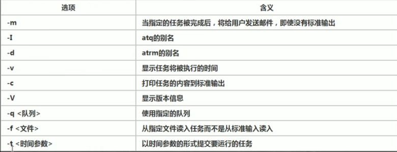

### 2.linux学习2
#### 2.1 Linux组介绍
在linux中每个用户必须存在于一个组中，每一个文件与目录均有所有者并且具有所有者权限-组内权限-外部权限。
1、`chown owner file`改变文件或者目录的所有者。`chown newO:nweG -R /dir`会将`dir`目录下包括其本身都会改变所有者与所在组。
2、`chgrp group file`修改文件所在的组。
3、`usermod -g 新组名 user`将user的组别修改到新的组里。
4、`usermod -d 目录 用户名`这会改变用户登录的初始目录。
#### 2.2 Linux权限介绍
利用`ls -l`命令会列出文件与目录的详细信息，如下图所示。

1、这一列一共有10个字符，第0个字符为`d`代表该文件是目录，`l`代表链接文件，`c`代表字符设备文件（如鼠标、键盘），`b`是块设备文件，如硬盘等。、
2、1-3字符为文件所有者的权限--user。
3、4-6字符为组内用户对该文件的权限--group。
4、7-9字符为其余用户对该文件的权限--other。
其中`-`代表不具有该权限，`r`为read权限:对于文件来说可以查看文件内容，对于目录来说可以ls读取目录内容，`w`为write权限:对于文件来说可以重写文件内容，对于目录来说可以新增文件或目录（创建、删除、重命名）。`x`为excute权限:对于文件来说可以被执行，对于目录来说可以被进入（如cd命令）。也可以使用数字代替`r=4,w=2,x=1`，比如要执行`rw-`即为`6`。`.`后面的数字对于文件来说是该文件的硬连接的数目，如果是目录代表该目录的子目录数。
`chmod`命令可以更改文件的权限，基本用法如下。
1、使用`+,-,=`变更权限。例如`chmod u=rw,g=r,o=r file`，或者`chmod u+x file`，或者`chmod o-w file`。这里u=所有者，g=所在组，o=其他用户，a=所有用户。
2、使用数字代表，例如`chomd 751 file`即等价于`chmod u=rwx,g=rx,o=x file`。
#### 2.2 crond任务调度
`crontab`进行定时任务的设置。
概述：任务调度：是指系统在某个时间执行特定的任务或程序。系统工作（需要周期定时进行，如病毒扫描），用户工作（用户希望定时一段时间备份数据等）。
基本语法：`crontab [opt]`，常用选项如下。
`crontab -e`编辑定时任务。
`crontab -l`查询crontab任务。
`crontab -r`删除当前用户所有的定时任务。
例如，为记录`/etc`目录下的内容，将该目录下的内容不断记录至`/tmp/to.txt`，可以使用`*/1 * * * * ls -l > /tmp/to.txt`，参数说明如下图。

下图为crontab的特殊符号说明。

#### 2.2 at定时任务
1、at是一次性定时计划任务，at的守护进程会以后台运行模式检查作业队列来运行。
2、默认情况下，atd会每60秒检查一次任务队列，有任务时，会检查任务的运行时间，如果时间与当前时间匹配则运行该任务。
3、at是一次性的定时计划任务，执行完毕后就不再执行。
4、在使用at时必须保证atd守护进程正在运行，可使用命令`ps -ef | grep atd`查看atd进程是否在运行。
基本语法:`at [选项] [时间]`at的相关选项如下图所示。

at命令的时间定义比较灵活，具体如下图所示。

必须注意的是进入at编辑后需要连续输入两次`Ctrl + d`才会生效退出。一下是at是命令示意图。

`atq`命令给出当前任务队列的内容，`atrm 编号`删除指定编号的任务。
#### 2.3 Linux磁盘分区与挂载(mount)
1、linux来说无论有几个分区，分给哪一个目录使用，它归根结底只有一个根目录，一个独立且唯一的文件结构，Liunx每一个分区都用来组成文件系统的一部分。
2、Linux采用了挂载（mount）的处理方法，它的整个文件系统包含了一整套文件和目录，且将一个分区和一个目录联系起来。这是要载入的分区将使得它的存储空间在一个目录下获得。原理图如下。

使用`lsblk -f`命令可以查看当前磁盘分区与文件挂载的详细信息。
以下步骤来说明如何增加新磁盘，并且完成分区。
1、物理接入新磁盘使用`lsblk`会看到新磁盘sdb，使用命令`fdisk /dev/sdb`进入磁盘设置交互界面，如下图所示。

输入`n`进行磁盘分区，输入分区属性（主分区/扩展分区），输入分区数量，保存并退出。
2、上面仅仅是完成了磁盘分区，此时磁盘并不能直接挂载，必须先格式化。使用命令`mkfs -t ext4 /dev/sdb1`将新磁盘的分区进行格式化，此时会产生唯一的系统识别号。
3、使用命令`mount /dev/sdb1 /newdisk/`即可将磁盘挂载在`/newdisk/`目录下。
如果需要卸载，`unmount /dev/sdb1`或者` unmont /newdisk/`。必须注意：使用命令行挂载的仅仅是临时挂载，系统重启后挂载失效。
`df -h /dir`命令显示该目录下的磁盘信息，会给出文件系统、容量、可用、已用与挂载点信息。

`du -hac --max-depth = 1 /dir `会给出指定目录下所有的文件与目录的信息。更改`--max-depth`参数，可以继续向下统计子目录里的内容。
`wc [opt]`可用来统计文件信息，`-l`统计行数，`-c`统计字节数，`-w`统计单词数。
`tree /dir`会将指定目录按树状列出，直观易懂。
#### 2.4 Linux网络配置
`/etc/sysconfig/network-scripts/`目录下，存放着系统的网络配置文件，比如使用`ifconfig`查看网络，显示如下。

网卡ens33的配置文件为`/etc/sysconfig/network-scripts/ifcfg-ens33`，使用vim打开可以看到ens33的配置信息如下。

以上配置信息显示该网络配置是静态的，并且具有IP地址、默认网关、子网掩码、DNS服务器地址。系统进行解析域名的顺序为：先对浏览器缓存进行查找，在对系统缓存进行查找、在查找本地hosts文件、在通过DNS域名服务器进行域名解析。