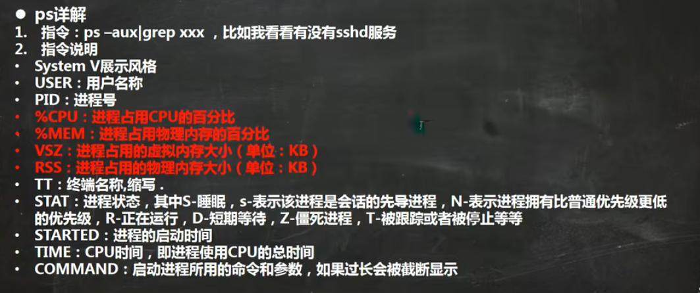
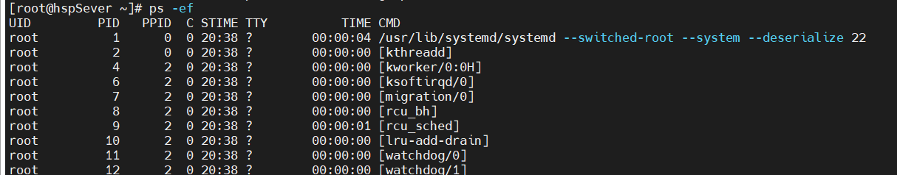
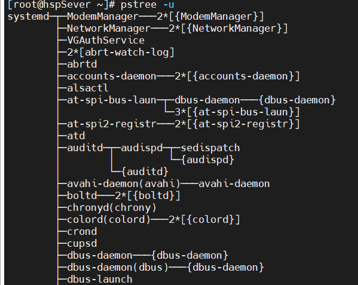
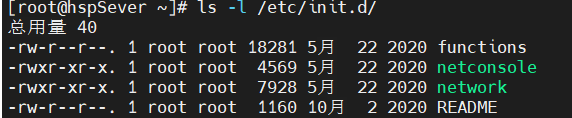

### 3.linux学习3

#### 3.1 Linux进程管理

LINUX中每一个运行的程序都称之为进程，每一个进程均具有进程号(pid)。每一个进程都有两种执行方式：前台运行与后台运行。简单来说，前台运行会占用一个终端，直到进程结束。`ps`命令可以查看当前运行的进程。

使用`ps -ef`可以列出进程的全部信息。

这里PPID为进程的父进程id号。这里需注意`/usr/lib/systemd/systemd`的进程id为1，并且父进程的id为0，这个进程是所有进程的祖进程。结束父进程会使子进程结束。结束进程可以使用命令`kill pid`或者`kill -9 pid`强制结束进程。
`pstree [opt]`命令可以将当前的进程以树状的关系列出，如下图所示。

这里发现`/usr/lib/systemd/systemd`是这棵树的根节点。使用`pstree -p`可以将进程id号出来，`pstree -u`可以将进程关系显示出来。

#### 3.2 Linux服务管理

1、service服务管理：service服务本质上就是一个后台进程，通常会监听某个端口、等待其他程序的请求，比如(mysql、sshd、防火墙等)，因此又称之为守护进程。
service管理指令，服务名[start|stop|restart|reload|status]，centos7.0之后很多服务不在使用service而是使用systemctl，service指令的服务可以在`/etc/init.d`中查看。

service的运行级别(runlevel)：常用运行级别为3与5。运行级别0：系统停机状态，系统默认运行级别不能设置为0，否则不能正常启动。运行级别1：单用户状态，root登录，用于系统维护，不能远程登录。运行级别2：多用户状态，没有网络(NFS)。运行级别3：完全的多用户状态，进入终端界面。运行级别4：系统未使用，保留。运行级别5：x11控制台，进入GUI模式。运行级别6：正常关闭系统并重启，默认级别不能为6否则无法正常启动。
LINUX开机过程：开机->BIOS->/boot->systemd->运行级别->运行级别对赢得服务。
`chkconfig`命令：通过chkconfig命令可以指定service管理的服务进程，在不同的系统运行级别下的启动/关闭。
基本语法：`chkconfig --list [| grep **]`查看服务状态。`chkconfig 服务名 --list`，列出指定的服务名。`chkconfig --level 5 服务名 off/on`给指定服务设置系统运行级别5时的启动状态。chkconfig设置之后需要reboot生效。
2、systemctl指令：基本语法：`systemctl [start|stop|restart|status] 服务名`。systemctl管理的服务在`/usr/lib/systemd/system`目录下查看。
systemctl 设置服务的自启动状态。
`systemctl list-unit-files [| grep 服务名]`(查看开机时服务的自启动状态，grep过滤)。
`systemctl enable 服务名`(可以设置服务开机自启动)。
`systemctl disable 服务名`(取消服务开机自启动)。
`systemctl is-enabled 服务名`(查询服务是否开机自启动)。
3、firewalld命令：打开端口`firewall-cmd --permanent --add-port=端口号/协议`。永久打开端口。关闭端口`firewall-cmd --permanet --remove-port=端口号/协议`。以上命令必须重新载入才会生效，`firewall-cmd --reload`。查询端口是否开放，`firewall-cmd --query-port=端口/协议`

#### 3.3 Linux动态监控

1、top与ps命令相似，他们都用来显示正在执行的进程，top与ps最大的不同之处在于top执行一段时间可以更新正在运行的进程，这意味着top会占用一个终端。
基本语法：`top [opt]`，选项说明`-d [秒数]`指定top每隔几秒更新，默认是3秒。`-i`使top不显示任何限制或者僵死进程。`-p`指定进程的PID号，仅仅监控该进程。进入top交互界面之后，可以通过指令与之交互，`P`按照cpu使用率进行排序，`M`按照内存使用排序，`N`按照pid进行排序，`q`退出top。
2、netstat命令：基本语法：`netstat [opt]`，选项说明如下。
`-an`按照一定的排序显示。
`-p`显示哪个进程正在调用

#### 3.4 rpm包管理

rpm用于互联网下载包的打包与安装工具，它包含于某些Liunx的分发版本中，它生成.RPM扩展名的文件。RPM是RedHat Package Manager的缩写，类似于windows的setup.exe，虽然有RedHat的标志但很多Linux的分发版本均支持。
rpm的查询指令:查询某个软件包是否安装，`rmp -qa`可以列出所有的已安装软件，可以通过`rpm -qa | grep **`查找需要的软件包。
`rpm -ql 软件包`可以列出指定软件包的安装文件。
`rpm -qf /dir/file`可以查询指定文件所属的软件包。
rpm的卸载指令:`rpm -e 软件包名`
rpm安装软件包：`rpm -ivh 软件包全路径`，`-i=install`安装，`-v=verbos`提示，`-h=hash`进度条。

#### 3.5 yum包管理

yum(Yellow dog Updater, Modifified)是一个shell前端的包管理器，基于RPM的包管理可以从指定服务器上下载并安装RPM软件包，并且自动处理依赖关系，一次性下载所有依赖包。
基本命令：`yum list | grep **`查看远程服务器是否有对象的软件包。`yum install **`安装指定的软件包。
