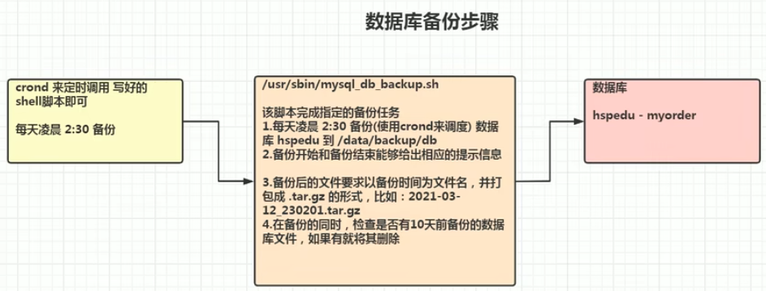

### <font face="宋体" >4.linux学习4

#### 4.1 shell编程

shell是一个命令解释器，它为用户提供了一个向内核发送请求以便运行的界面系统级程序，用户可以使用shell启动，挂起，停止甚至编写程序。
1、shell脚本的第一行一般需要加入`#!/bin/bash`，这样在给文件增加可执行权限之后，可以直接运行shell脚本。
2、事实上，除了`#!/bin/bash`还可以使用其他版本的shell解释器，比如用户自定义`#!/usr/bin/perl`shell脚本解释器的位置。`echo $0`会打印出当前使用的shell

#### 4.2 shell变量

##### shell变量介绍

1、Linux中shell变量分为系统变量与用户变量。
2、系统变量：`$HOME`，`$PWD`，`$SHELL`，`$USER`等可以使用`echo`在终端打印查看。
3、显示当前shell中所有的变量`set`。

##### shell变量定义

基本语法：
1.定义变量：`变量名=值`(主要中间不要有空格。
2.撤销变量：`unset 变量名`。
3.声明静态变量：`readonly 变量名`，静态变量不能unset撤销。

``` shell
#!/bin/bash
#案例1，定义变量并输出
A=10
echo "${A}"
#撤销静态变量
unset A
echo "$A"
#定义静态变量
readonly B=20
echo "$B"
# unset B 静态变量不可销毁
```

shell变量的命名规则
1、变量名称可以由字母数字下划线组成，但是不能以数字开头。
2、等号两侧不能有空格。
3、变量名称一般为大写。
将命令的返回值赋值给变量
1、A=\`date\` ，命令部分使用单引号``引出。
2、等价于`A=$(date)`

##### shell环境变量

基本语法
1、export 变量名=变量值，功能：将shell变量输出为环境变量/全局变量
2、source 配置文件，功能：使修改的环境变量生效。
3、echo $变量名，功能：终端输出环境变量值。
`/etc/profile`中定义了全局变量。可以使用`export A=10`增加环境变量，并且`source /etc/profile`使其生效。增加后的环境变量可以在任何用户和脚本下均可使用这个环境变量。shell脚本的多行注释：`:<<!`内容`!`。

##### shell位置参数变量

在执行一个shell脚本时希望获得外部参数，例如`./case.sh 100 200`，可以通过位置参数变量获得命令行输入的参数信息。
1、`$n`:n为数字`$0`代表命令本身，`$1-9`代表1-9个参数，大于9的参数需要使用`${10}`。
2、`$*`:这个变量会把命令行输入的所有参数看成一个整体。
3、`$@`:与`$*`类似，会把输入的参数看成一个整体，但会区别对待每一个参数。
4、`$#`:代表输入参数的个数。

```shell
#!/bin/bash
#文件名case2.sh
echo "0=$0"
echo "1=$1, 2=$2"
echo "所有参数=$*"
echo "$@"
echo "参数个数=$#"
```

增加权限`chmod u+x case2.sh`，并运行`./case.sh 100 200`后，输出

```shell
0=./case2.sh
1=100, 2=200
所有参数=100 200
100 200
参数个数=2
```

##### shell预定义变量

预定义变量时shell设计者事先定义的变量可以直接使用，具体如下。
1、`$$`:该变量为当前进程的pid号。
2、`$!`:后台运行进程的最后一个PID号。
3、`$?`:最后一次执行的命令返回状态，值为0，上一个命令执行正确。非零则执行错误。

```shell
#!/bin/bash
echo "pid=$$"
#以后台的方式运行一个脚本，并获取它的进程id
./case2.sh 400 190 &
# & 符号该进程会以后台方式进行
echo "pid1=$!"
#查看上一个运行的进程是否成功
echo "$?"
```

输出结果为

```shell
pid=43776
pid1=43777
0
[root@hspSever shcode]# 0=./case2.sh
1=400, 2=190
所有参数=400 190
400 190
参数个数=2
```

当前终端会一直被占用，原因为在case3.sh中运行了另一个脚本case2.sh。

##### shell中的运算符

基本语法
1、`$((运算式))`或者`$[运算式]`，或者`expr m + n`。
2、注意`expr`表达式里的空格，没有空格会报错，如果想将该表达式赋值给另一个变量，必须加``。
3、`expr m - n`
4、expr时， `\*`、`/`、`%`分别代表，乘、除、取余。
以求表达式(2+3)x4为示例，代码如下。

```shell
#!/bin/bash
#案例1：计算(2+3)x4的值
#使用第一种方式
RES1=$(((2+3)*4))
echo "res1=${RES1}"
#第二种写法
RES2=$[(2+3)*4]
echo "res2=${RES2}"
#第三种写法
TEMP=`expr 2 + 3`
echo "temp=${TEMP}"
RES3=`expr $TEMP \* 4`
echo "res3=$RES3"
```

##### shell条件判断

基本语法
`[ condtion ]`注意条件condition前后均有空格，非空返回true，可使用`$?`验证（0为true，>1为false）。
条件判断
1、字符串的比价`=`
2、两个整数的比较：`-lt`小于，`-le`小于等于，`-eq`等于，`-gt`大于，`-gq`大于等于，`-ne`不等于。
3、按照文件权限判断：`-r`有读的权限，`-w`有写的权限，`-x`有执行权限。
4、按照文件类型判断：`-f`文件存在并且是普通文件，`-e`文件存在，`-d`文件存在并且是目录。
流程控制

```shell
#基本语法
if [ condtion ]
then
    代码
#多分支
if [ condtion ]
then
    代码
elif [ condtion ]
then
    代码
```

注意条件中的中括号与条件表达式之间有空格
另一个流程控制的语句case使用如下。

```shell
#基本语法
case $变量名 in
"值1")
如果变量值等于值1则执行程序1。
;;
"值2")
如果变量值等于值1则执行程序2。
;;
"值3")
如果变量值等于值1则执行程序3。
;;
"值4")
如果变量值等于值1则执行程序4。
;;
*)
如果以上变量值均不匹配，执行此程序。
;;
esac
```

循环控制语句`for`基本语法1

```shell
for 变量 in 值1 值2 值3 ...
do
代码
done
```

以下是示例代码，将命令行输入的参数分别打印出来。

```shell
for i in "$*"
do
    echo "num is $i"
done
```

输出结果为`num is 100 200 300`，可见`$*`将所有命令行参数当成一个整体，包括空格。
循环控制语句`for`基本语法2

```shell
for ((初始值;循环控制条件;变量变化))
do
代码
done
```

测试案例，输出从1加到100的值

```shell
#!/bin/bash
SUM=0
for ((i=1;i<=100;i++))
do
        SUM=$[$SUM+$i]
done
echo "sum = $SUM"
```

这里需要注意`SUM`赋值的时候不能使用`$SUM`，增加`$`表示对之前定义变量进行取值。
循环控制语句`while`介绍如下

```shell
while [ condtion ]
do
程序
done
```

注意`[]`里的条件判断式与中括号之间有空格

##### read读取控制台输入

基本语法：`read(选项)(参数)`
选项：`-p`指定读取值时的提示符；`-t`指定读取值时的时间(秒)，如果未在等待时间内输入就不再等待了。
参数：变量：指定读取时的变量名。

##### shell函数

函数介绍：与其他编程语言一样，shell也可以定义并使用函数。shell中的函数分为系统函数与用户自定义函数。
系统函数介绍：basename与dirname
basename:可以获得指定文件完整目录的文件名。
`basename /home/dekanglee/test.txt`会返回`test.txt`。`basename /home/dekanglee/test.txt .txt`会返回`test`将后缀也去掉了。
dirname:与basename相反，可以获取文件的目录路径部分，`dirname /home/dekanglee/test.txt`返回`/home/dekanglee`
自定义函数，基本语法如下

```shell
[function] funname[()]
{
    Action;
    [return int;]
}
```

##### shell综合案例-数据库定时备份

具体思路与要求如下图所示。



使用crond定时调用编写好的shell脚本即可。
