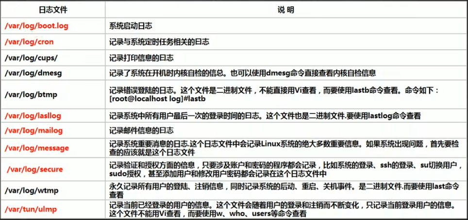

### 4.linux学习4

#### 4.1 linux日志介绍

基本介绍：
1：日志文件是重要的系统文件，其中记录了很多重要的系统日志事件，包括用户的登录信息，系统的启动信息，系统的安全信息，邮件相关信息，各种服务相关的信息。
2：日志对于安全来说也很重要，它记录了系统每天发生的各种事情，可以通过日志来检查错误发生的原因，或者收到攻击时留下的痕迹。
3：可以将日志理解为强大的系统记录工具。
大多数系统日志存放于`/var/log`目录下。系统的常用日志目录信息如下图。

#### 4.2 linux日志管理服务rsyslogd

rsyslogd是liunx的后台服务程序，管理着很多的日志，其配置文件为`/etc/rsyslog.conf`。
在编辑其文件格式是要注意`*.*`，其中第一个`*`代表日志类型，第二个`*`代表日志级别。
1、日志类型可以分为：
auth                    ##pam产生的日志
authpriv                ##ssh、ftp等登录验证信息
corn                    ##时间任务相关
kern                    ##内核
lpr                     ##打印
mail                    ##邮件
mark(syslog)-rsyslog    ##服务的内部信息，时间标识
news                    ##新闻组
user                    ##用户程序产生的信息
uucp                    ##unix to nuix主机之间通信产生的信息
local 1-7               ##自定义的日志设备
2、日志级别
debug                   ##有调试信息的，日志通信最多
info                    ##一般日志信息，最常用
notice                  ##最有重要性的普通条件信息
warning                 ##警告级别
err                     ##错误级别，组织摸个功能或者模块不能工作的信息
crit                    ##严重错误级别，阻止整个系统或者整个软件不能工作的信息
alter                   ##需要立即修改的信息
emerg                   ##内核崩溃等重要信息
none                    ##什么都不记录
以上日子级别的等级，从上至下，由低到高。记录信息越少。
由rsyslogd记录的日志文件信息共有4列：事件产生的时间、产生时间的服务器的主机名，产生事件的服务名或程序名、事件的具体信息。

