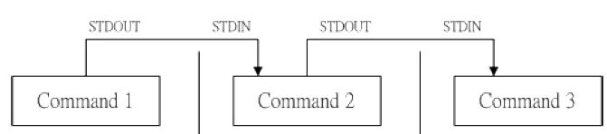

### <font face="宋体" >4.linux学习4

#### 4.1 bash介绍

所谓的shell是用户与内核之间进行交互的中间层，操作系统内核不能直接识别用户的命令，需要有一个中间层充当“翻译的角色”。
shell本版本很多，在目录`/etc/shells`文件中可以看到系统支持的shell版本以及目录位置。

```shell
/bin/sh
/bin/bash
/usr/bin/sh
/usr/bin/bash
/bin/tcsh
/bin/csh
```

系统默认使用的是`/bin/bash`，bash也是目前linux分发版本中的标准。用户在使用bash的时候，使用的记录会存放在`~/.bash_history`文件中，默认可以存放1000条，登录成功后可以查看上一次使用的bash命令，但是当前的命令不会被记录进去，而是存放在缓存中。`history [opt]`命令可以显示过去使用的bash命令。

`alias`是bash提供的命令别名设置，比如`alias ls= 'ls -al'`
bash中有很多内置命令可以使用`type [-tpa] name`查看，以下是选项说明。
1、不加任何选项，type会显示是外部命令还是内置命令。
2、-t：type会输出以下结果：file表示外部命令，alias表示命令别名，builtin表示是bash的内置命令。
2、-p；如果是外部命令会显示出完成的文件名
3、-a会将环境变量PATH中所有的name的命令列出。
测试发现cd、alias、type等均是bash的内置命令，而ls不是。而常用的cp，mv，rm居然均是alias类型，原因是用户的bash配置文件`~/.bashrc`中将这些命令重命名。

```shell
alias rm='rm -i'
alias cp='cp -i'
alias mv='mv -i'
```

用户登录shell时，会进行一系列文件的引用与脚本的调用，最终形成`~/.bash_profile`文件，这个文件就是用户最终shell的配置环境，里面包含了环境变量一系列内容。具体的配置过程见下图。


#### 4.2 shell变量的功能

这里必须说明在shell脚本中单引号，与双引号的区别。如果一个变量中间存在空格，必须使用单引号或双引号引出，在双引号下${var}会保持var原来的特性。但是单引号会将其视作纯文本。
shell中存在环境变量，不同用户的环境变量既有相同也有不同的，相同部分一般是系统的环境变量，如PATH、SHELL等，任何用户都可以使用。而不同的往往是与用户信息相关的环境变量，如USER、HOME、PWD等。
`ulimit`命令：可以很好地限制文件系统与程序，`ulimit -a`显示当前系统对用户的限制。

```shell
core file size          (blocks, -c) 0          #只要是0就表示没有限制
data seg size           (kbytes, -d) unlimited
scheduling priority             (-e) 0
file size               (blocks, -f) unlimited  #可创建单一文件的大小
pending signals                 (-i) 15594
max locked memory       (kbytes, -l) 64
max memory size         (kbytes, -m) unlimited
open files                      (-n) 1024       #可打开的文件数量(这个在内核中被写定了，与之前网络编程呼应了)
pipe size            (512 bytes, -p) 8
POSIX message queues     (bytes, -q) 819200
real-time priority              (-r) 0
stack size              (kbytes, -s) 8192       #程序栈的空间大小
cpu time               (seconds, -t) unlimited  
max user processes              (-u) 4096
virtual memory          (kbytes, -v) unlimited
file locks                      (-x) unlimited
```

使用`ulimit [opt] 份额`可以修改限制，例如`ulimit -s 16384`修改栈的大小。

#### 4.3 shell字符串删除

设置`path="/usr/bin:/usr/local/sbin:/usr/sbin:/home/dmtsai/.local/bin:/home/dmtsai/bin"`，删除关键字为`#`从左向右匹配删除最短的匹配，`##`从左向右匹配删除最长的匹配，`%`从右向左匹配删除最短的匹配，`%%`右向左匹配删除最长的匹配。示例代码如下

```shell
path="/usr/bin:/usr/local/sbin:/usr/sbin:/home/dmtsai/.local/bin:/home/dmtsai/bin

echo "${path#/*:}"
# result:/usr/local/sbin:/usr/sbin:/home/dmtsai/.local/bin:/home/dmtsai/bin
echo "${path##/*:}"
# result:/home/dmtsai/bin

echo "${path%:/*bin}"
# result:/usr/bin:/usr/local/sbin:/usr/sbin:/home/dmtsai/.local/bin
echo "${path%%:/*bin}"
# result:/usr/bin
```

#### 4.4 linux数据重定向

linux中标准输入输出分成：标准输入(stdin)，标准输出(stdout)，标准错误输出(stderr)。在目录`/dev/`下可以查看，

```shell
ls /dev/std*
/dev/stderr  /dev/stdin  /dev/stdout
```

1、重定向输出
linux中使用`>`作为重定向输出，例如`ls > file.txx`，这里需要注意，ls是标准输出一般显示在终端，使用输出重定向可以将结果定向至文件中。或者`cat file1 >> file2`这里的`>>`是追加，cat的输出会追加到file2中，而`>`为覆盖file2之前的内容。
2、重定向输入
输入一般由终端通过键盘进行输入，例如`cat`命令会进入用户交互界面，让用户在终端进行输入。如果使用`cat > file1 < file2`则输入重定向会将file2的内容输入cat而输出重定向会将标准输出至file1，其结果即是file1获得与file2相同的内容。示例代码如下。

```shell
cat << EOF > file2
> li
> de
> kang
> EOF

cat file2
li
de
kang
```

3、标准错误输出
在运行一些命令时会有标准错误输出，比如输入的命令错误，终端会显示错误信息，如输入命令不存在，相似命令为***，使用`command 2> errfile`可以将错误输出信息重定向至文件errfile。在该文件内可以查看错误信息，终端不会显示错误信息。与标准输出介绍的一样`2>>`为追加方式。
具体见下图所示


解释一个用法`command > file 2>&1`，这里的`2>&1`，代表的含义是，将标准错误输出`2`重定向至标准输出`>&1`其中`&1`可以理解为对标准输出的引用。是否可以换成`command 2>&1 > file`，不可以，这种写法使得标准错误输出依然会输出至终端，不会输入到file中。
如将标准输出与标准错误输出重定向至file，命令为`command > file 1>&2`，注意没有空格。如果不希望有任何输出，可以重定向至`/dev/null`，即`command > /dev/null`。该文件比较特殊，写入该文件的内容都会被丢弃，并且该文件不可读。

#### 4.5 linunx管道命令(pipe)

linux中一个命令的标准输出可以作为另一个命令的标准输入，管道(pipe)就是连接两个命令的桥梁。管道命令的符号为`|`，使用方式为`command1 | command2 | command3 ...`，下图是管道命令图示。



需要注意的是管道对于标准错误输出没有处理能力。管道命令后面的第一个词一定是linux命令，并且该指令可以接受标准输入。例如`ls -al | cat > file1`，ls的输出为标准输出，cat命令可以接受标准输入。如果需要通过管道命令处理标准错误输出`ls -al 2>&1 | cat > file1`，将标准错误输出与标准输出合并即可。
与管道命令不同的是，连续命令执行。这种方式与输入输出无关，具体来说命令之间使用`;`、`&&`，`||`连接。其中`;`连接的命令，无论之前的命令结果如何下一个命令都会被执行，`&&`连接的命令，之前的命令如果执行失败，则后面使用`&&`连接的不再执行。`||`连接的命令只有前一个命令执行失败后面才会执行，若执行成功后面使用`||`连接的命令不再被执行。

```shell
echo 1 ; echo 2 ; echo 3 ; echo 4
1
2
3
4
echo 1 && echoo 2 && echo 3 && echo 4
1
错误提示2
echo0 1 || echoo 2 || echo 3 || echo 4
错误提示1
错误提示2
3
echo0 1 || echoo 2 || echo 3 ; echo 4
错误提示1
错误提示2
3
4
echoo 1 || echo 2 || echo 3 || echo 4 && echoo 5 && echo 6 ; echo 7
错误提示1(||)
2
错误提示5(&&)
7
```
